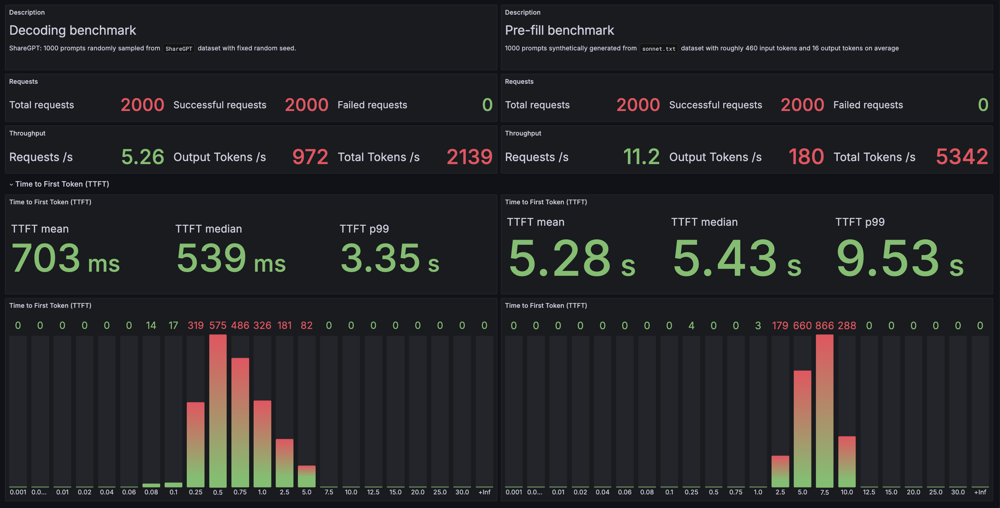

# vllm-inference-benchmark

## Description

This Helm chart deploys a fixed ammount of pods (`replicaCount`) with 2 containers:
1. vLLM server with the following parameters:
    ```yaml
    - --model=/model-storage/{{ .Values.servedModel }}
    - --served-model-name={{ .Values.servedModel }}
    - --tensor-parallel-size=8
    - --max-num-batched-tokens=16384 
    - --max-model-len=16384 
    - --num-scheduler-steps=16
    - --enable-chunked-prefill=False
    - --seed=42
    ```
    where `{{ .Values.servedModel }}` corresponds to the model running on the vLLM server. It depends on the node configuration: pick `meta-llama/Llama-3.1-405B-Instruct-FP8` for H100 and `meta-llama/Llama-3.1-405B-Instruct` for H200 GPUs.

2. `load-generator` is a FastAPI application which serves request according to supplied config. There are 2 ways of setting up benchmark configuration:
    - Adjust `benchmarkSpecs` in `values.yaml`
    - Send a request to `/start-load` endpoint with the following type of payload:
        ```json
        {
            "host": "localhost",
            "port": 8000,
            "num_prompts": 1000,
            "request_rate": 12,
            "model": "meta-llama/Llama-3.1-405B-Instruct-FP8",
            "backend": "openai-chat",
            "endpoint": "/v1/chat/completions",
            "dataset_path": "app/sonnet.txt",
            "dataset_name": "sonnet",
            "sonnet_input_len": 512,
            "sonnet_prefix_len": 128,
            "sonnet_output_len": 2
        }
        ```
    Once done, the result with corresponding benchmark metrics will be saved as a JSON in `BENCHMARK_RESULTS_BUCKET`/`BENCHMARK_RESULTS_DIRECTORY`. The following metrics are provided:
    ```
    ============ Serving Benchmark Result ============
    Successful requests:                     1000
    Benchmark duration (s):                  142.65
    Total input tokens:                      221844
    Total generated tokens:                  184511
    Request throughput (req/s):              7.01
    Output token throughput (tok/s):         1293.45
    Total Token throughput (tok/s):          2848.60
    ---------------Time to First Token----------------
    Mean TTFT (ms):                          2768.57
    Median TTFT (ms):                        870.16
    P99 TTFT (ms):                           10724.08
    -----Time per Output Token (excl. 1st token)------
    Mean TPOT (ms):                          147.65
    Median TPOT (ms):                        148.96
    P99 TPOT (ms):                           276.89
    ---------------Inter-token Latency----------------
    Mean ITL (ms):                           1279.56
    Median ITL (ms):                         1343.86
    P99 ITL (ms):                            2669.44
    ==================================================
    ```

## Installation

First, you need to install `model-storage` for accessing s3 buckets with model weights and for saving results. Make sure you install it in the same namespace with this Helm chart. You will also need your Hugging Face token for this.
```bash
export HF_TOKEN=<hf_token>
helm install inference-benchmark-backend . \                 
  --namespace=<job-namespace> \
  --set hfToken=$HF_TOKEN
```
To check on the benchmark progress, connect to `grafana`:
```bash
kubectl --namespace o11y port-forward service/grafana 8080:80
```
You may create a dashboard with the contents of `grafana_dashboard.json` for monitoring:


## Stress testing

To load GPUs close to their TDP, use pre-fill heavy benchamark with `"sonnet"` dataset.

For H100, use request rate of 12 (choose 10 for H200 if you are running `meta-llama/Llama-3.1-405B-Instruct` in bf16 precision) and 500000 prompts (adjust if necessary).

This leads to the following power consumption for 11h:
- avg per GPU consumption - 675W, going over 710W on max
- host consumption 5.47kW

