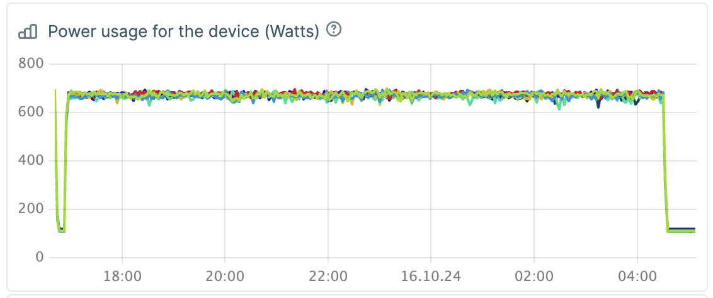

# inference-backend-benchmark

to begin: add HF_TOKEN to `env` variables

payload for load-generator:

```json
{
    "host": "localhost",
    "port": 8000,
    "num_prompts": 500000,
    "request_rate": 12,
    "model": "meta-llama/Llama-3.1-405B-Instruct-FP8",
    "backend": "openai-chat",
    "endpoint": "/v1/chat/completions",
    "dataset_path": "app/sonnet.txt",
    "dataset_name": "sonnet",
    "sonnet_input_len": 512,
    "sonnet_prefix_len": 128,
    "sonnet_output_len": 2
}
```

This leads to the following load for 11h:
- avg per GPU consumption - 675W, going over 710W on max
- host consumption 5.47kW

